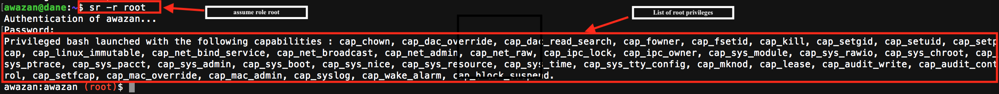

# RootAsRole (V2.2) : a secure alternative to sudo/su on Linux systems

## Feedback

You may give us your feedbacks  about RootAsRole here:

<https://docs.google.com/forms/d/e/1FAIpQLSfwXISzDaIzlUe42pas2rGZi7SV5QvUXXcDM9_GknPa8AdpFg/viewform>

## Video presentation of the version 1.0 (in French)

https://www.youtube.com/watch?v=2Y8hTI912zQ

## Intro

Traditionally, administering Linux systems is based on the existence of one powerful user (called super user) who detains alone the full list of system’s privileges.  This vision has been criticized because all programs executed in the context of the super user obtain much more privileges than they need. For example, tcpdump, a tool for sniffing network packets, needs only the privilege cap_net_raw to run. However, by executing it in the context of super user, tcpdump obtains the full list of systems’ privileges. Thus, the traditional approach of Linux administration breaks the principle of the least privilege that ensures that a process must have the least privileges necessary to perform its job (i.e. sniff packet networks). An attacker may exploit vulnerabilities of tcpdump to compromise the whole system, when the process of tcpdump possesses the full list of root privileges.

Root As Role (RAR) module implements a role based approach for distributing Linux capabilities into Linux users. Our module contains a tool called sr (switch role) that allows users to control the list of privileges they give to programs. Thus, with our module Linux users can stop using sudo and su commands that don't allow controlling the list of privileges to give to programs. There are already some tools that permit to control the list of privileges to give to programs such as setcap and pam_cap module. However, these tools necessitate the use of extended attributes to store privileges. Storing privileges in extended attributes causes many different problems (see below motivation scenarios). Our module allows assigning Linux capabilities without the need to store the Linux capabilities in the extended attributes of executable files. Our work leverages a new capability set added to Linux kernel, called Ambient Set. 

Using RAR module, administrators can group a set of Linux capabilities in roles and give them to their users. For security reasons, users don’t get the attributed roles by default, they should activate them using the command sr (switch role). Our module is compatible with pam_cap.so. So administrators can continue using pam_cap.so along with our module.  

Finally, RAR module includes a tool called capable, this tool helps Linux users to know the privileges that an application asks for.

## Tested Platforms

Our module has been tested only on Ubuntu>=16.04 (Kernel 4.3) and Debian platforms.

## Installation

### How to Build

  1. git clone https://github.com/SamerW/RootAsRole
  2. cd RootAsRole
  3. sudo sh ./configure.sh
  4. make
  5. sudo make install

### Usage

Usage : sr [-r role | -c command] [-n] [-u user] [-v] [-h]

    -r, --role=role        the capabilities role to assume

    -c, --command=command  launch the command instead of a bash shell

    -n, --no-root          execute the bash or the command without the possibility to increase privilege (e.g.: sudo) and with no special treatment to root user (uid 0)

    -u, --user=user        substitue the user (reserved to administrators and used probably for service managment)

    -i, --info             print the commands the user is able to process within the role and quit

    -v, --version          print the version of RAR

    -h, --help             print this help and quit.

After the installation you will find a file called capabilityRole.xml in the /etc/security directory. You should configure this file in order to define the set of roles and assign them to users or group of users on your system. Once configuration is done, a user can assume a role using the ‘sr’ tool  that is installed with our package.

To edit the configuration file you must first assume the root role using the sr tool. The role root is defined by default with the list of all privileges. To assume the role Root, type in your shell the following command :
`sr -r root`

After that a new shell is opened. This shell contains the capabilities of the role that has been taken by the user. You can then edit capabilityRole.xml file to define your own roles (/etc/security/capabilityRole.xml).

For more details, please see **[How to use](https://github.com/SamerW/RootAsRole/wiki/How-to-use)**

## Capable Tool

Since V2.0 of RootAsRole, we created a new tool that permits to retrieve capabilities asked by a program or a service. This can be very important when a user wants to configure the sr tool in order to inject the capabilities requested by a program.  Please note that you should pay attention to the output of the tool, especially with regards the cap_sys_admin capability. In most cases, programs don't need this capability but we show it because this what Linux kernel returns to the capable tool.

For more details please see [Here](https://github.com/SamerW/RootAsRole/tree/master/ebpf)

## [Motivations and Some Working Scenarios](https://github.com/SamerW/RootAsRole/wiki/Motivations-and-Some-Working-Scenarios)

## [How sr and sr_aux work?](https://github.com/SamerW/RootAsRole/wiki/How-sr-and-sr_aux-work)

## Contributors

Ahmad Samer Wazan : ahmad-samer.wazan@irit.fr

Rémi Venant: remi.venant@gmail.com

Guillaume Daumas : guillaume.daumas@univ-tlse3.fr

Eddie Billoir : eddie.billoir@gmail.com

Romain Laborde : laborde@irit.fr

## Limitations

1. we handle the arguments of commands in a very basic way. In fact, when an administrator limits the use of a role to a command with a list of arguments, the user must provide exactly the same commands with the list of arguments in the same order as they are defined in the capabilityRole.xml file. Handling the arguments of commands in more flexible way is a very complex task. Commands have different formats for arguments; the same argument may have different names;some arguments may take values, others not; values of arguments have different formats, etc.

## To Do List

1. Add the possibility to restrict the assuming of roles with time. An administrator can indicate the period of time where a user can assume roles.

2. Find an approach that allows controlling the use of privileges on a resource. For example, when cap_net_bind_service is given to a user , we want to indicate the port number that the user can use with this privilege. A possible solution is to use kprobe or to develop  LSM hooks.

3. Give the possibility to all users and all groups to run programs with some privileges. For example, an administrator wants to authorise all users to use ping program. In this case, he can edit the capabilityRole.xml to define a role that has cap_net_raw. In the user and group nodes, the administrator can use the character * for representing the list of all users and groups. Users can then use sr to assume the role and run the ping program, but they don't need to authenticate themselves to assume the role.

4. Today only root user can assume the role of other users. This is should be extended to give the possibility to any user who has the privileges cap_setuid, cap_setgid, cap_setfcap and cap_dac_override  to assume the roles of any user. This feature can be used for service management. Right now, even a user with root role can not assume the roles of other users because sr tool has two privileges in its extended attributes. According to capabilities calculation rules sr is considered as privileged file and it will not acquire as consequence the values of the shell's ambient. As consequence, it is important to build a new wrapper like sr_admin that doesn't have any privileges in its extended attributes. In this case, sr_admin will get a copy of its shell's ambient. So sr_admin will be able to have cap_setuid, cap_setgid, cap_setfcap and cap_dac_override when it is run by a shell that has these values in its ambient.  After that sr_admin should create a temporary file of sr tool, and then add the cap_setuid, cap_setgid and cap_dac_override in the extended attributes (permitted set) of the sr temporary file (sr has already cap_setfcap and setpcap) and makes an exec call to sr by passing at least the roles and user arguments. Optionally, sr_admin can pass also noroot and command arguments. Technically, sr_admin needs only cap_setfcap to be able to write the privileges in the sr temporary file but it should verify that user who runs it has cap_setuid, cap_setgid, cap_setfcap and cap_dac_override as sr tool will use these privileges when running the commands on behalf of other users. If the user's shell has these privileges in its effective set, sr_admin accept the request of the user to assume the roles of other users and it will write cap_setuid, cap_setgid and cap_dac_override in the extended attributes of sr temporary file, in addition to cap_setfcap and cap_setpcap that already exist in the extended attributes of sr temporary file.  A modification to sr code is also required to consider this feature that is reserved today to root user.

5. Test our module on other distributions of Linux and make our installation et configuration scripts applicable to them.

6. Use YAML or JSON instead of XML to fix quotes and apos in same string problems

7. Use Query language (XPath or other in JSON if To-Do #6) instead of sequential search of role

8. Managing blacklist, whitelist and translating list for environnement variables. [inspirated by sudo environnement variables handling system](https://www.sudo.ws/repos/sudo/file/tip/plugins/sudoers/env.c)

9. Find a way to automate creation of role, when command given that does not exist in roles. This must be done after enhancement of filter system for the capabilities on capable tool ([TODO #3 of Capable](https://github.com/SamerW/RootAsRole/tree/master/ebpf#to-do)) , and also after the stack analysis of capable ([TODO #1 of Capable](https://github.com/SamerW/RootAsRole/tree/master/ebpf#to-do)). And optionnaly after [TODO #2 of Capable](https://github.com/SamerW/RootAsRole/tree/master/ebpf#to-do).

## References

[1] PAM repository : <https://github.com/linux-pam/linux-pam>

[2] libcap repository : <https://github.com/mhiramat/libcap>

Very helpful site, where you can find some informations about PAM, libcap and the capabilities:

[3] Original paper about capabilities : <https://pdfs.semanticscholar.org/6b63/134abca10b49661fe6a9a590a894f7c5ee7b.pdf>

[4] Article about the capabilities : <https://lwn.net/Articles/632520/>

[5] Article about Ambient : <https://lwn.net/Articles/636533/>

[6] Simple article with test code for Ambient : <https://s3hh.wordpress.com/2015/07/25/ambient-capabilities/>

[7] Article about how PAM is working : <https://artisan.karma-lab.net/petite-introduction-a-pam>

[8] A very helpful code about how to create a PAM module : <https://github.com/beatgammit/simple-pam>

Source of the scenarios code:

[9] Where I have found the simple Python code for HTTP server : <https://docs.python.org/2/library/simplehttpserver.html>

[10] Where I have found the simple PRELOAD code : <https://fishi.devtail.io/weblog/2015/01/25/intercepting-hooking-function-calls-shared-c-libraries/>

[11] Serge E.Hallyn, Andrew G.Morgan, “Linux capabilities: making them work”, The Linux Symposium, Ottawa, ON, Canada (2008), <https://www.kernel.org/doc/ols/2008/ols2008v1.pages-163.172.pdf>
