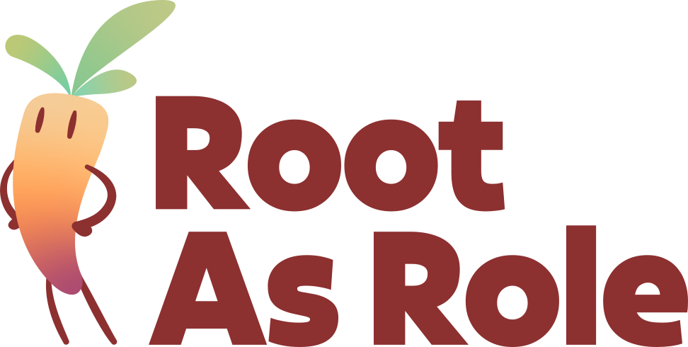

<!-- markdownlint-capture -->
<!-- markdownlint-disable -->

  
 

 

  

<!-- markdownlint-restore -->

# RootAsRole — An security-enhanced alternative to `sudo(-rs)`/`su`

RootAsRole is a Linux/Unix privilege delegation tool based on **Role-Based Access Control (RBAC)**. It empowers administrators to assign more precise privileges to users and commands.

**[📚 Full Documentation for more details](https://lechatp.github.io/RootAsRole/)**

## Why does it exists?

Cybersecurity threats are no longer just from outside. The concept of privileged access, mainly used by system administrators, is one of the most fertile avenue for internal exploitation. These users often have unrestricted control over critical systems, making the latter prime targets for malicious actions. Many software supply-chain attacks demonstrates it as well[[1](https://web.archive.org/web/20260604042101/https://arstechnica.com/tech-policy/2023/05/ex-ubiquiti-engineer-behind-breathtaking-data-theft-gets-6-year-prison-term/), [2](https://web.archive.org/web/20260704163511/https://boehs.org/node/everything-i-know-about-the-xz-backdoor), [3](https://web.archive.org/web/20260706114236/https://www.wsj.com/articles/SB10001424052748704629804575324510662164360)]. 

[The Principle of Least Privilege](https://www.cs.virginia.edu/~evans/cs551/saltzer/) (PoLP) is an engineering process that involves understanding users' responsibilities to grant them only the minimum permissions required to accomplish their tasks using computer systems. This principle applies to all users but is paramount for system administrators, who often possess elevated privileges essential for system maintenance but can also present substantial risks when misused.

Tools like `sudo` and `su` are granting all privileges to users. The simple fact that today's Linux systems majorly rely on these tools is a clear indication that the PoLP is not being effectively implemented. Combining the system administrator risk with these tools is a concern in the IT landscape.

## Goals

RootAsRole has three main goals, which can be summarized as follows: 

* Providing the means to specify more precise access control policies for Linux administrators.

* Providing an organisational access control model for Linux administrators in order to start a first step towards to the analysis of their own profession, which is a part of role-engineering work.

* Providing an technical solution for reducing Linux administrative tools and subtools privileges that administrators uses in they daily work.

**[📚 Full Documentation for more details](https://lechatp.github.io/RootAsRole/)**

## Non-goals

Among others, RaR does not aim to:

* Alter the Linux kernel architecture, e.g., to fix the [Confused Deputy](https://doi.org/10.1145/54289.871709) problem.

* Implementing the [Object-capability model](https://doi.org/10.1145/365230.365252). Because this model is not solving the Least Privilege problem.

* RaR does not aim to completely automate security governance without human oversight.

If you need more explanations about why, you can read my PhD thesis, which is available online (written in english, while the website is in french): [Orchestrating and enforcing the principle of least administrative privileges in Linux systems](https://utheme.utoulouse.fr/s/fr/item/45273).

## [Letter on AI policy, position and implementation usage](./AI_LETTER.md)

This README took parts of my PhD thesis, ESORICS 2025 conference paper and is also adapted a bit for the project purpose. All of these contents are not AI-assisted.

The documentation is quite different from the README. It does have AI-assisted parts. However, CaRoot, our mascott, gives only human-written advices.

## Branding

The project's mascot and logos were created entirely by hand by [Eva La Fougère](https://www.karde.me/evalafougere?utm_source=rootasrole&utm_medium=docs&utm_content=readme)!

The mascot and its variants are licensed under CC BY-ND 4.0 and the copyright belongs to Eva La Fougère.

The mascot serves as the visual identity of the official RootAsRole project. It must not be used by third-party projects, derivative works, or forks as their primary visual identity in a manner that could create confusion with the official project or suggest endorsement by the RootAsRole project.

## Licence

The project is licensed under [LGPL-3.0](./LICENSE).

This project also includes [sudo-rs](https://github.com/memorysafety/sudo-rs) code licensed under the Apache-2 and MIT licenses: 
We have included cutils.rs, securemem.rs to make work the rpassword.rs file. Indeed, We thought that the password was well managed in this file and we have reused it. As sudo-rs does, rpassword.rs is from the rpassword project (License: Apache-2.0). We use it as a replacement of the rpassword project usage.

## Sponsors

This project was initiated by **IRIT** and sponsored by both **IRIT** and **Airbus PROTECT** through an industrial PhD during 2022 and 2025.

## [Link to References](https://lechatp.github.io/RootAsRole/bibliography.html)
<!-- markdownlint-capture -->
<!-- markdownlint-disable -->

  
 

<!-- markdownlint-restore -->