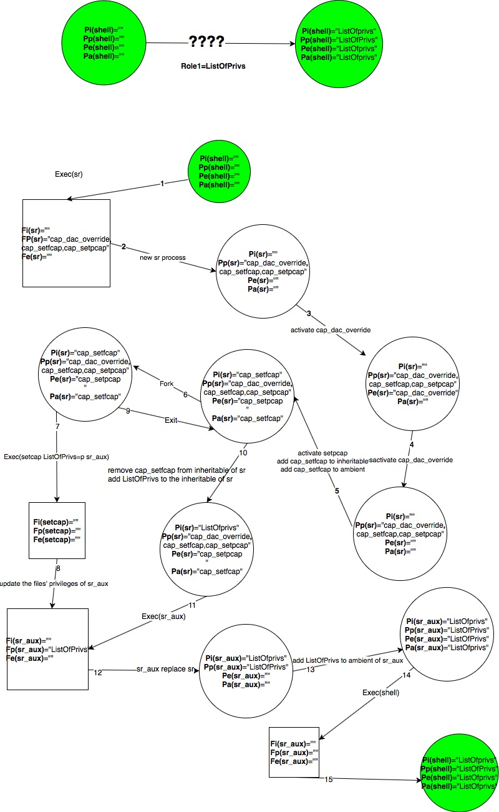

Authors
=======

Rémi Venant: remi.venant@gmail.com

Ahmad Samer Wazan : ahmad-samer.wazan@irit.fr

Guillaume Daumas : guillaume.daumas@univ-tlse3.fr

Intro
=====

Root As Role (RAR) module implements a role based approach for distributing Linux capabilities into Linux users. Our module contains a tool called sr (switch role) that allows users to control the list of privileges they give to programs. Thus, with our module Linux users can stop using sudo and su commands that don't allow controlling the list of privileges to give to programs. There are already some tools that permit to control the list of privileges to give to programs such as setcap and pam_cap module. However, these tools necessitate the use of extended attributes to store privileges. Storing privileges in extended attributes causes many different problems (see below motivaiton scenarios). Our module allows assigning Linux capabilities without the need to store the Linux capabilities in the extended attributes of executable files. Our module leverages a new capability set added to Linux kernel, called Ambient Set. Using this module, administrators can group a set of Linux capabilities in roles and give them to their users. For security reasons, users don’t get the attributed roles by default, they should activate them using the command sr (switch role). Our module is compatible with pam_cap.so. So administrators can continue using pam_cap.so along with our module. Concretely, our module allows respecting the least privilege principle by giving the users the possibility to control the list of privileges they give to their programs.  

Tested Platforms
===========
Our module has been tested only on Ubuntu and Debian platforms.

Installation
===========

How to Build
------------

	1. git clone https://github.com/guillaumeDaumas/switchRole
    
    2. cd switchRole
    
    3. sudo ./configure.sh
    
    4. make
    
    5. sudo make install
    
Usage
-----

After the installation you will find a file called capabilityRole.xml in the /etc/security directory. You should configure this file in order to define the set of roles and assign them to users or group of users on your system. Once configuration is done, a user can assume a role using the ‘sr’ tool  that is installed with our package.

To edit the configuration file you must first assume the root role using the sr tool. The role root is defined by default with the list of all privileges. To assume the role Root, type in your shell the following command :
`sr -r root` 

After that a new shell is opened. This shell contains the capabilities of the role that has been taken by the user. You can verify by reading the capabilities of your shell (cat /proc/$$/status). When you make an exit() you return to your initial shell without any privilege.

Here is a typcial example of the configuration file. Here the administrator defines the role1 that contains the privileges cap_net_raw and cap_sys_nice. Users awazan and remi are authorised to assume this role. However, user remi can assume this role only when he runs the programs tcpdump and iptables. user awazan can run any programs with the assumed role because he will get a privileged shell. In addition, members of groups adm , office and secretary can also assume the role role1. 

As you may note, here the user awazan has got a shell with privileged cap_net_raw and cap_sys_nice are activated.

**Conflictual Situations**

A conflict may be created when the list of programs defined at the user level is different from the list of programs defined at group level. For exemple, here the list of programs of remi is different from the list of programs for the group secretary that belongs to remi's groups. In this case, the configurtion at the user level has more prioirity and user remi can only run tcpdump and iptables with this role but not printer program. The rational behind this is that we consider that configuration at user level help administrators to add exceptions to the treatment of groups.

For example, suppose that we have edited our configuration file as following:

User awazan is member of adm group. So here we have conflitual situation because user awazan can run only tcpdump with this role, whereas his group allows him to have a privileged shell. As explained before, we give more priority to configuration of the user awazan. So in this case user awazan will be only able to run tcpdump, although that the other members of his group will be able to have a privileged shell.

Another conflictual situation can be created between groups. For example, we have edited the configuration file to allow the members of groups adm, awazan and secretary to assume the role role1. No configuration is defined for user awazan. However, user awazan belongs to groups adm and awazan that have conflictual configurations. 

In this case, we designed our module to give the most generous decision. So in this case, the user awazan will get a privileged shell.

Finally users can be suspended from assuming roles by adding an empty commands attributes. For example, here we suspend the user awazan from assuming the role role1.

As you may notice, the user awazan is not able to assume role1.

**Get the List of available commands**

A user can know the list of commands that he can use with a role by adding the i option. For example, here the user awazan uses the i option to know the list of commands he can use with the role role1.

Here user awazan can use with role1 the commands tcpdump and iptables.

**No Root mode**

You have the possibility to launch a full capabale shell that doesn't give any special treatment to uid 0. The root user is considered as any other normal user and you can in this case grant him a few privileges in the capabilityRole.xml distributed by our module :

`sr -n -r role1`

We use the securebits to provide this functionality. Any set-uid-root program will be run without having any special effect. So in the shell, you can't for example use the ping command without a role that has cap_net_raw privilege.

For example, when we launch the sr tool with the root user but without the option -n : 

as you see, the root user obtains the full list of privileges.

Here is the result when we add the -n option : 

As you see now, the root user didn't obtain the full list of privileges.

Under this mode, set-uid-root programs will not have the full list of privileges and they can not be launched.

For example, lets check the result of the ping program. Suppose that we assign the role2 to root user as follows:

When the root user assume the role2 with -n option, he can't use `ping 0` because cap_net_raw is not present its role.

If we modify the configuration to assign role1 that conains cap_net_raw privilege to root user, we see that he can now use ping:

.

Why our module is better than sudo, su and setuid-root programs
===========
Sudo, su and setuid-root bit allows programs to run with the full list of root privileges. Here we give an example for removing the bit s from passwd program.

Why our module is better than setcap and pam_cap.so
===========

Scenario 1
-----
A user contacts his administrator to give him a privilege that allows him running an HTTP server that is developed using Python. His script needs the privilege CAP_NET_BIND_SERVICE to bind the server socket to 80 port.  Without our module, the administrator has two options: (1)  Use setcap command to inject the privilege into Python interpreter or (2) use pam_cap.so to attribute the CAP_NET_BIND_SERVICE to the user and then inject this privilege in the inheritable and effective sets of the interpreter. Both solutions have security problems because in the case of option (1), the Python interpreter can be used by any another user with this privilege. In the case of option (2) other python scripts run by the legitimate user will have the same privilege.

Here a simple python script that needs to bind a server on the port 80 [9] (the user running the script needs CAP_NET_BIND_SERVICE to do that).

If we try to execute the script without any privilege, we get the expected 'Permission denied'.

The first solution consists in using the setcap command in order to attribute the cap_net_bind_service capability to the python interpreter. Doing this create a security problem; now users present in the same system have the same privilege. 

The second solution is to use pam_cap.so module, as follows:

The administrator sets cap_net_bind_service in the /etc/security/capability.conf file (pam_cap's configuration file).

As you see, the inheriable set of the shell has now the new capability.

The administrator has to use setcap command to inject cap_net_bind_service in the Effective and Inheritable set of the interpreter. After that the user can run the script.

However, in this case all scripts run by the same user will have the same privilege :(

Our solution provides a better alternative. Suppose that the capabilityRole.conf contains the following configuration:

                                  role1 cap_net_bind_service guillaume none 
Then the user needs only to assume role1 using our sr tool and then run his (her) script. (S)he can use other shell to run the other non-privileged scripts.

And as we can see here, python binary doesn't have any capabilities.

Scenario 2 
-----
Suppose a developer wants to test a program that (s)he has developed in order to reduce the downloading rate on his server. The developer should use the LD_PRELOAD environment variable to load his shared library that intercepts all network calls made by the servers’ processes. With the current capabilities tools, the administrator of the server can use setcap command or pam_cap.so to give the developer cap_net_raw. However, the developer cannot achieve his test because, for security reasons, LD_PRELOAD doesn't work when capabilities are set in the binary file.

This is an example program which tries to open a raw socket (cap_net_raw needed) [10]:

This is a code which tries to intercept the socket() call [10].

As we can see, we need cap_net_raw to open this socket.

But, when the LD_PRELOAD is configured, Linux kernel disable the interception of socket() call. The following figure shows how the interception works correctly after having removed the capability from the binary file (setcap -r), and not correctly when the capacity is re-added to the binary file.

With our module, no need set the capability in the binary file: you can open the socket and intercept the connection.

Scenario 3 
-----
an administrator wants to attribute a user the privilege to run an apache server. Without our module, the administrator can use either setcap command to inject the necessary privilege in the binary of apache server (option1) or use pam_cap.so module and setcap command (option2). Both options have problems: All systems' users will get this privilege in the case of option 1. The configuration of the binary apache will be lost after updating the apache package. 

To achieve this objective using our module, an admininstrator should follow the following steps:

1- Grant the privilege cap_bet_bind_service, cap_dac_override to the user by editing capabilityRole.conf file. Note that cap_dac_override is not mandatory if the administraor changes the ownership of the log files.

2- Define a script (lets call it runapache.sh) that has the following commands: source /etc/apache2/envvars and /usr/sbin/apache2
						   
3-User can assume the role and run the apache service using the command sr:
sr -r role1  -c 'runapache.sh'

4-verify that the apache process has only the cap_net_bind_service and cap_dac_override in its effective using this command: cat /proc/PID/status

Scenario 4 
-----
Two developers create a shared folder in which they stored a common program that they develop together. This program requires cap_net_raw privilege. The developers have to mount their shared folder using NFS v3.  This scenario is not feasible with the current tools because NFS v3 doesn’t support extended attributes. 

Service Managment Scenario 
-----

An administrator wants to launch a set of services like apache and ssh by giving them only the privileges that they need. (S)he may use the command setcap or pam_cap.so to define the necessary privileges in the binary of each service. However all configuration will be lost after an update.

To launch the apache service using our module, an admininstrator should follow the following steps:

1- Grant the privilege cap_bet_bind_service to the user by editing capabilityRole.conf file,

2- Define a script (lets call it runapache.sh) that has the follwing commands: source /etc/apache2/envvars
						   /usr/sbin/apache2
						   
3-as a root, run the follwing command:

sr -r role1 -u apacheuser -n -c 'runapache.sh'

4-verify that the apache process has only the cap_net_bind_service in its effective using this command: cat /proc/PID/status

How sr works
===========
You might be interested to know how we implement the sr tool. So here is the algorithm: 

In terms of capabilities calucations by Linux Kernel, here is what happens:

References
==========

[1] PAM repository : https://github.com/linux-pam/linux-pam

[2] libcap repository : https://github.com/mhiramat/libcap

Very helpfull site, where you can find some informations about PAM, libcap and the capabilities:

[3] Original paper about capabilities : https://pdfs.semanticscholar.org/6b63/134abca10b49661fe6a9a590a894f7c5ee7b.pdf

[4] Article about the capabilities : https://lwn.net/Articles/632520/

[5] Article about Ambient : https://lwn.net/Articles/636533/

[6] Simple article with test code for Ambient : https://s3hh.wordpress.com/2015/07/25/ambient-capabilities/

[7] Article about how PAM is working : https://artisan.karma-lab.net/petite-introduction-a-pam

[8] A very helpfull code about how to create a PAM module : https://github.com/beatgammit/simple-pam

Source of the scenarios code:

[9] Where I have found the simple Python code for HTTP server : https://docs.python.org/2/library/simplehttpserver.html

[10] Where I have found the simple PRELOAD code : https://fishi.devtail.io/weblog/2015/01/25/intercepting-hooking-function-calls-shared-c-libraries/
