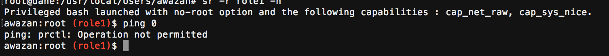

Authors
=======

Rémi Venant: remi.venant@gmail.com

Ahmad Samer Wazan : ahmad-samer.wazan@irit.fr

Guillaume Daumas : guillaume.daumas@univ-tlse3.fr

Intro
=====
Traditionally, administering Linux systems is based on the existence of one powerful user (called super user) who detains alone the full list of system’s privileges.  This vision has been criticized because all programs executed in the context of the super user obtain much more privileges than they need. For example, tcpdump, a tool for sniffing network packets, needs only the privilege cap_net_raw to run. However, by executing it in the context of super user, tcpdump obtains the full list of systems’ privileges. Thus, the traditional approach of Linux administration breaks the principle of the least privilege that ensures that a process must have the least privileges necessary to perform its job (i.e. sniff packet networks). An attacker may exploit vulnerabilities of tcpdump to compromise the whole system, when the process of tcpdump possesses the full list of root privileges.

As consequence, a POSIX draft (POSIX draft 1003.1e) has been proposed in order to distribute the privileges of super user into processes by giving them only the privileges they need [11]. The proposal defines for each process three sets of bitmaps called Inheritable (i), Permitted (p) and Effective (e).  This model has not been adopted officially, but it has been integrated into the kernel of Linux since 1998. 

However, for different reasons this model has not been used widely. Firstly, Linux capability model suffers from different technical problems because of the use of extended attributes to store privileges in the executables (problem 1). Secondly, System administrators don’t have a tool that allows them to distribute the privileges into Linux users in fine-grained manner (problem 2). Fine-grained privilege distribution should give the administrators the ability to decide which privileges to give to users, which programs (e.g. tcpdump) users can use these privileges and on which resources these privileges can be applied (e.g. network interface eth0).  Thirdly, Linux doesn’t provide a tool that permits to Linux users to know the privilege that an application asks for (problem 3). Fourthly, Linux comes with some basic commands that are not comptaible with privileges, such as passwd command (problem 4). As a consequence, the majority of Linux users still use su and sudo commands to run privileged applications because the super user model has the advantage of being easy to use. 

Recently, a new privilege set called Ambient has been integrated into the kernel of Linux in order to cope with the technical problems related to the sorting of privileges in the extended attributes of executables. However, Linux doesn’t provide solutions to handle the problem 2 and 3.

Root As Role (RAR) module implements a role based approach for distributing Linux capabilities into Linux users. It provides a soluton to problem 2. Our module contains a tool called sr (switch role) that allows users to control the list of privileges they give to programs. Thus, with our module Linux users can stop using sudo and su commands that don't allow controlling the list of privileges to give to programs. There are already some tools that permit to control the list of privileges to give to programs such as setcap and pam_cap module. However, these tools necessitate the use of extended attributes to store privileges. Storing privileges in extended attributes causes many different problems (see below motivaiton scenarios). Our module allows assigning Linux capabilities without the need to store the Linux capabilities in the extended attributes of executable files. Our module leverages a new capability set added to Linux kernel, called Ambient Set. Using this module, administrators can group a set of Linux capabilities in roles and give them to their users. For security reasons, users don’t get the attributed roles by default, they should activate them using the command sr (switch role). Our module is compatible with pam_cap.so. So administrators can continue using pam_cap.so along with our module. Concretely, our module allows respecting the least privilege principle by giving the users the possibility to control the list of privileges they give to their programs.  

Tested Platforms
===========
Our module has been tested only on Ubuntu and Debian platforms.

Installation
===========

How to Build
------------

	1. git clone https://github.com/SamerW/RootAsRole
    
    2. cd switchRole
    
    3. sudo sh ./configure.sh
    
    4. make
    
    5. sudo make install
    
Usage
-----
Usage : sr -r role [-n] [-c command] [-u user] [-h]

	-r, --role=role        the capabilities role to assume

	-c, --command=command  launch the command instead of a bash shell

	-n, --no-root          execute the bash or the command without the possibility to increase privilege (e.g.: sudo) and with no special treatment to root user (uid 0)

	-u, --user=user        substitue the user (reserved to administrators and used probably for service managment)

	-i, --info             print the commands the user is able to process within the role and quit

	-h, --help             print this help and quit.

After the installation you will find a file called capabilityRole.xml in the /etc/security directory. You should configure this file in order to define the set of roles and assign them to users or group of users on your system. Once configuration is done, a user can assume a role using the ‘sr’ tool  that is installed with our package.

To edit the configuration file you must first assume the root role using the sr tool. The role root is defined by default with the list of all privileges. To assume the role Root, type in your shell the following command :
`sr -r root` 

After that a new shell is opened. This shell contains the capabilities of the role that has been taken by the user. You can then edit capabilityRole.xml file to define your own roles (/etc/security/capabilityRole.xml).

Example
-----

The advantage of RootAsRole module is that it allows controlling the list of privileges that you use with your programs. The administrator should configure the capabilityRole.xml file to achieve this objective. Here is a typcial example of the configuration file. Here the administrator defines the role1 that contains the privileges cap_net_raw and cap_sys_nice. Users awazan and remi are authorised to assume this role. However, user remi can assume this role only when he runs the programs tcpdump and iptables. user awazan can run any programs with the assumed role because he will get a privileged shell. In addition, members of groups adm , office and secretary can also assume the role role1. 

As you may note, here the user awazan has got a shell with privileges cap_net_raw and cap_sys_nice that are activated.

Another interesting feature of our module is that it allows controlling indirectly the resource on which the privilege will be used. For example,  let's suppose that the administrator wants to let user awazan to use the privilege cap_net_raw only with tcpdump and only on the interface ens160. In this case, the administrator should provide the following configuration file:

As you see here, user awazan can run tcpdump to sniff the traffic of ens160 interface, but not other interfaces.

It should be noted that when the administrator doesn't precise any arguments with a command, the user can run the command with any option (s)he wants. 

**Conflictual Situations**

A conflict may be created when the list of programs defined at the user level is different from the list of programs defined at group level. For exemple, here the list of programs of remi is different from the list of programs for the group secretary that belongs to remi's groups. In this case, the configurtion at the user level has more prioirity and user remi can only run tcpdump and iptables with this role but not printer program. The rational behind this is that we consider that configuration at user level help administrators to add exceptions to the treatment of groups.

For example, suppose that we have edited our configuration file as following:

User awazan is member of adm group. So here we have conflitual situation because user awazan can run only tcpdump with this role, whereas his group allows him to have a privileged shell. As explained before, we give more priority to configuration of the user awazan. So in this case user awazan will be only able to run tcpdump, although that the other members of his group will be able to have a privileged shell.

Another conflictual situation can be created between groups. For example, we have edited the configuration file to allow the members of groups adm, awazan and secretary to assume the role role1. No configuration is defined for user awazan. However, user awazan belongs to groups adm and awazan that have conflictual configurations. 

In this case, we designed our module to give the most generous decision. So in this case, the user awazan will get a privileged shell.

Finally users can be suspended from assuming roles by adding an empty commands attributes. For example, here we suspend the user awazan from assuming the role role1.

As you may notice, the user awazan is not able to assume role1.

**Get the List of available commands** (-i option)

A user can know the list of commands that he can use with a role by adding the i option. For example, here the user awazan uses the i option to know the list of commands he can use with the role role1.

Here user awazan can use with role1 the commands tcpdump and iptables.

No Root mode (-n option)
-----

You have the possibility to launch a full capabale shell that doesn't give any special treatment to uid 0. The root user is considered as any other normal user and you can in this case grant him a few privileges in the capabilityRole.xml distributed by our module :

`sr -n -r role1`

We use the securebits to provide this functionality. Any set-uid-root program will be run without having any special effect. So in the shell, you can't for example use the ping command without a role that has cap_net_raw privilege. 

Our modules forces the using of -n option when the current user is root. In this case, we are sure that the configuration of the administrator for root user is respected.

For example, lets suppose that the administrator has defined the following configuration for root and awazan users. Linux kernel has a special treatment for the root user. In this case, Linux kernel will give the list of all privileges to root user. We don't want that because we consider that the list of privileges should be distributed based on roles idea and not based on the uid of users. For this reason, we force the using of -n option to deactivate the default behaviour of Linux kernel.

The root user must use "-n" option to assume a role.

.

As you see, the root user obtains only the list of privileges given to him by the administrator.

.

Under this mode, set-uid-root programs will not have the full list of privileges and they can not be launched.

.

Why our module is better than sudo, su and setuid-root programs
===========
Linux is not yet a full privileged system. It has a special treatment for the root user. Whenever a process has in its effective uid the value 0, it will be given the the whole list of root privileges. Sudo, su and setuid-root bit give the possibility to programs to have an effective uid equal to 0. Thus, these programs are run with the full list of root privilege, although that these programs need only one part of these privileges. Thus, the traditional approach of Linux administration breaks the principle of the least privilege that ensures that a process must have the least privileges necessary to perform its job.

However, one can use our module to obtain similar results to su and sudo commands:

1- 'sr -r root' is equivalent to 'su' command, as it permits to obtain a privileged shell with the full list of root privileges.

2- 'sr -r root -c command' is equivalent to 'sudo command', as it permits to run a command with the full list of root privileges.

As mentionned and illustrated earlier, the advantage of our module is that it allows controlling the list of privileges given to programs.

In addition, our module allows removing the bit s from Linux executables. In Linux, different basic commands comes with bit s, such as ping, passwd and mount commands. The bit s (setuid bit) allows a user to run a program with the privileges of program's owner. The owner of ping, passwd and mount commands is root, so any user can run these programs with the root's privileges.
As an example lets run the passwd command in one shell, and check the list of privilges acquired by this program in another shell.

We notice that passwd possesses the whole list of root privileges, which constitutes a big security problem. 

One can use our module to remove the bit s from executables but this will not work for all of them because some of them are coded to check the uid 0 and not the privilges. This is the case of passwd. In fact, passwd checks whether the real uid is 0 or not. When the real uid is 0 (i.e. process run by root user) the programs allows the root user to change the passwords of any user. When the real uid is not 0, then the user can change only his own password (for more information check the source code of passwfd and especially the variable amroot https://github.com/shadow-maint/shadow/blob/master/src/passwd.c). Passwd program must be thus modified to allow any user who has the convenient privilege to modify the passwords of other users. For example, an administrator may give the privilege cap_dac_override to user awazan only to modify the passwords other users by limiting the use of this privilege to passwd program.

We can use our module to remove the bit s from ping because ping is privilege aware. Interestingly, ping's code source has a function called limi_capabilites() (https://github.com/iputils/iputils/blob/master/ping.c). It uses this function to remove the list of of root privileges that it doesn't need because ping needs only cap_net_raw capability. Lets show how we can remove the bit s from ping program:

1- assume the role root using the sr tool

2- we check the ping has the bit s

3- we remove the bit s from ping using the command chmod

4-we quit our privileged shell and we check that we can not use any more the ping program.

5-we re-assume the role root to configure our capabilityRole.xml file so that the user awazan can use ping program. Here is the new configuration file.

6-user awazan assume the role1 with the "-c" option to run ping program. 

It works!

Why our module is better than setcap and pam_cap.so
===========

We give here several scenarios that illustrate that our module is better than setcap and pam_cap.so:

Scenario 1
-----
A user contacts his administrator to give him a privilege that allows him running an HTTP server that is developed using Python. His script needs the privilege CAP_NET_BIND_SERVICE to bind the server socket to 80 port.  Without our module, the administrator has two options: (1)  Use setcap command to inject the privilege into Python interpreter or (2) use pam_cap.so to attribute the CAP_NET_BIND_SERVICE to the user and then inject this privilege in the inheritable and effective sets of the interpreter. Both solutions have security problems because in the case of option (1), the Python interpreter can be used by any another user with this privilege. In the case of option (2) other python scripts run by the legitimate user will have the same privilege.

Here a simple python script that needs to bind a server on the port 80 [9] (the user running the script needs CAP_NET_BIND_SERVICE to do that).

If we try to execute the script without any privilege, we get the expected 'Permission denied'.

The first solution consists in using the setcap command in order to attribute the cap_net_bind_service capability to the python interpreter. Doing this create a security problem; now users present in the same system have the same privilege. 

The second solution is to use pam_cap.so module, as follows:

The administrator sets cap_net_bind_service in the /etc/security/capability.conf file (pam_cap's configuration file).

As you see, the inheriable set of the shell has now the new capability.

The administrator has to use setcap command to inject cap_net_bind_service in the Effective and Inheritable set of the interpreter. After that the user can run the script.

However, in this case all scripts run by the same user will have the same privilege :(

Our solution provides a better alternative. Suppose that the capabilityRole.conf contains the following configuration:

                                  role1 cap_net_bind_service guillaume none 
Then the user needs only to assume role1 using our sr tool and then run his (her) script. (S)he can use other shell to run the other non-privileged scripts.

And as we can see here, python binary doesn't have any capabilities.

Scenario 2 
-----
Suppose a developer wants to test a program that (s)he has developed in order to reduce the downloading rate on his server. The developer should use the LD_PRELOAD environment variable to load his shared library that intercepts all network calls made by the servers’ processes. With the current capabilities tools, the administrator of the server can use setcap command or pam_cap.so to give the developer cap_net_raw. However, the developer cannot achieve his test because, for security reasons, LD_PRELOAD doesn't work when capabilities are set in the binary file.

This is an example program which tries to open a raw socket (cap_net_raw needed) [10]:

This is a code which tries to intercept the socket() call [10].

As we can see, we need cap_net_raw to open this socket.

But, when the LD_PRELOAD is configured, Linux kernel disable the interception of socket() call. The following figure shows how the interception works correctly after having removed the capability from the binary file (setcap -r), and not correctly when the capacity is re-added to the binary file.

With our module, no need set the capability in the binary file: you can open the socket and intercept the connection.

Scenario 3 
-----
an administrator wants to attribute a user the privilege to run an apache server. Without our module, the administrator can use either setcap command to inject the necessary privilege in the binary of apache server (option1) or use pam_cap.so module and setcap command (option2). Both options have problems: All systems' users will get this privilege in the case of option 1. The configuration of the binary apache will be lost after updating the apache package. 

To achieve this objective using our module, an admininstrator should follow the following steps:

1- Grant the privilege cap_bet_bind_service, cap_dac_override to the user by editing capabilityRole.conf file. Note that cap_dac_override is not mandatory if the administraor changes the ownership of the log files.

2- Define a script (lets call it runapache.sh) that has the following commands: source /etc/apache2/envvars and /usr/sbin/apache2
						   
3-User can assume the role and run the apache service using the command sr:
sr -r role1  -c 'runapache.sh'

4-verify that the apache process has only the cap_net_bind_service and cap_dac_override in its effective using this command: cat /proc/PID/status

Scenario 4 
-----
Two developers create a shared folder in which they stored a common program that they develop together. This program requires cap_net_raw privilege. The developers have to mount their shared folder using NFS v3.  This scenario is not feasible with the current tools because NFS v3 doesn’t support extended attributes. 

Service Managment Scenario 
-----

An administrator wants to launch a set of services like apache and ssh by giving them only the privileges that they need. (S)he may use the command setcap or pam_cap.so to define the necessary privileges in the binary of each service. However all configuration will be lost after an update.

To launch the apache service using our module, an admininstrator should follow the following steps:

1- Grant the privilege cap_bet_bind_service to the user by editing capabilityRole.conf file,

2- Define a script (lets call it runapache.sh) that has the follwing commands: source /etc/apache2/envvars
						   /usr/sbin/apache2
						   
3-as a root, run the follwing command:

sr -r role1 -u apacheuser -n -c 'runapache.sh'

4-verify that the apache process has only the cap_net_bind_service in its effective using this command: cat /proc/PID/status

How sr works
===========
You might be interested to know how we implement the sr tool. So here is the algorithm: 

Here is how sr_aux works:

In terms of capabilities calucations by Linux Kernel, you can read this page to know how Linux kernel calculates the capabilities in different scenarios:

https://github.com/SamerW/RootAsRole/blob/master/doc/sr_details_on_caps_manipulation.md

To Do List
===========
1- enhance the treatement of commands so that when an administrator defines for a user a command without arguments, the user can run the command with any arguments. Our current version of code makes an exact comparaison with the command node, this should be extended to handle more correctly the arguments:

	a-We should extend the structure of capablityRole.xml to include argument nodes.
	
	b-our code must first compare whether the right command is used and then compare whether the authorized arguments are used or not.
	
	c-if there is no arguments precised along with the command, our code should authorise any arguments with the command.
	
2-enhance the -i option to print out the roles and the associtated commands for a user. When a user calls sr  with only -i option he can get this information.

3-add the possibility to restrict the assuming of roles with time. An administrator can indicate the period of time where a user can assume roles. 

4- create a command to help users figure out what are privileges needed by program. A possible solution is to use kprobe to trace cap_capable() in the kernel.

5- find an approach that allows controlling the use of privileges on a resource. For example, when cap_net_bind_service is given to a user , we want to indicate the port number that the user can use with this privilege. A possible solution is to use krpobe or to develop  LSM hooks.

6-give the possibility to all users and all groups to run programs with some privileges. For example, an administrator wants to authorise all users to use ping program. In this case, he can edit the capabilityRole.xml to define a role that has cap_net_raw. In the user and group nodes, the administrator can use the character * for repersenting the list of all users and groups. Users can then use sr to assume the role and run the ping program, but they don't need to authenticate themselves to assume the role.

7-today only root user can assume the role of other users. This is should be extended to give the possiblity to any user who has the privileges cap_setuid, cap_setgid, cap_setfcap and cap_dac_override  to assume the roles of any user. This feature can be used for service management. Right now, even a user with root role can not assume the roles of other users because sr tool has two privileges in its extended attributes. According to capabilities calculation rules sr is considered as privileged file and it will not acquire as consequence the values of the shell's ambient. As consequence, it is important to build a new wrapper like sr_admin that doesn't have any privileges in its extended attributes. In this case, sr_admin will get a copy of its shell's ambient. So sr_admin will be able to have cap_setuid, cap_setgid, cap_setfcap and cap_dac_override when it is run by a shell that has these values in its ambient.  After that sr_admin should create a temporary file of sr tool, and then add the cap_setuid, cap_setgid and cap_dac_override in the extended attributes (permitted set) of the sr temporary file (sr has already cap_setfcap and setpcap) and makes an exec call to sr by passing at least the roles and user arguments. Optionally, sr_admin can pass also noroot and command arguments. Technically, sr_admin needs only cap_setfcap to be able to write the privileges in the sr temporary file but it should verify that user who runs it has cap_setuid, cap_setgid, cap_setfcap and cap_dac_override as sr tool will use these privileges when running the commands on behalf of other users. If the user's shell has these privileges in its effective set, sr_admin accept the request of the user to assume the roles of other users and it will write cap_setuid, cap_setgid and cap_dac_override in the extended attributes of sr temporary file, in addition to cap_setfcap and cap_setpcap that already exist in the extended attributes of sr temporary file.  A modification to sr code is also required to consider this feature that is reserved today to root user.

References
==========

[1] PAM repository : https://github.com/linux-pam/linux-pam

[2] libcap repository : https://github.com/mhiramat/libcap

Very helpfull site, where you can find some informations about PAM, libcap and the capabilities:

[3] Original paper about capabilities : https://pdfs.semanticscholar.org/6b63/134abca10b49661fe6a9a590a894f7c5ee7b.pdf

[4] Article about the capabilities : https://lwn.net/Articles/632520/

[5] Article about Ambient : https://lwn.net/Articles/636533/

[6] Simple article with test code for Ambient : https://s3hh.wordpress.com/2015/07/25/ambient-capabilities/

[7] Article about how PAM is working : https://artisan.karma-lab.net/petite-introduction-a-pam

[8] A very helpfull code about how to create a PAM module : https://github.com/beatgammit/simple-pam

Source of the scenarios code:

[9] Where I have found the simple Python code for HTTP server : https://docs.python.org/2/library/simplehttpserver.html

[10] Where I have found the simple PRELOAD code : https://fishi.devtail.io/weblog/2015/01/25/intercepting-hooking-function-calls-shared-c-libraries/

[11] Serge E.Hallyn, Andrew G.Morgan, “Linux capabilities: making them work”, The Linux Symposium, Ottawa, ON, Canada (2008), https://www.kernel.org/doc/ols/2008/ols2008v1-pages-163-172.pdf
